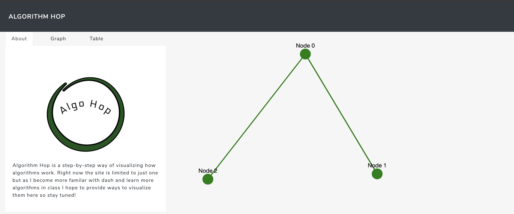

[](https://ab-algorithmhop.herokuapp.com)

---

![python] ![dash] ![Heroku]



[python]: https://img.shields.io/github/pipenv/locked/python-version/ablades/algohop?style=flat-square 

[dash]: https://img.shields.io/github/pipenv/locked/dependency-version/ablades/algohop/dash?style=flat-square

[Heroku]: https://img.shields.io/badge/heroku-deployed-brightgreen?style=flat-square

# About

Algorithm Hop(AlgoHop) is meant to be an alterative way to view and understand algorithms. Currently the scope is one algorithm but as I flesh out the program and get further along in my studies I hope to be able to implement many more algorithms.

# Viewing the App

The app is available to view [here.](https://ab-algorithmhop.herokuapp.com/) Please give it a mintue to load as heroku(where it's hosted) takes about a minute to spin up a server.

# Running Locally

## Pre-requisites
If you would like to run the app locally make sure you install the dependiences found in `Pipfile.lock`.
More information about the dependencies can be found in the [built with](#built-with) section further down in the readme.


Then simply run:

```bash 
python3 app.py
```

Which will spin up a development server at located at http://127.0.0.1:8050/


# Built With

[Plotly](https://plot.ly/graphing-libraries/) - A great open source graphing library that has a multitude of graphs, plots, and charts available to use.

[Dash](https://dash.plot.ly/) - Based off [Flask](https://palletsprojects.com/p/flask/), Dash is a great framework for building web-based analytic programs.

[Dash Bootstrap Components](https://dash-bootstrap-components.opensource.faculty.ai/) - Provides useful layouts and components specifically for Plotly's Dash framework.


